Once upon a corona quarantine day, I wanted to create a fully privileged process by becoming system. My desire was to get unlimited access to any user-mode process on the system. After stealing system's token I was granted unlimited power, or so I thought.. 

In this post I'll show you the journey I went on trying to get full access to a privileged process

# Humble begginings

The goal of this prject being getting complete access to protected processes, we will start of by making a small c program which attempts to open a process with [PROCESS_ALL_ACCESS](https://docs.microsoft.com/en-us/windows/win32/procthread/process-security-and-access-rights) rights:

```c
	DWORD pid = atoi(argv[1]);

	while(1)
	{
		if ((h = OpenProcess(PROCESS_ALL_ACCESS, 0, pid)))
			break;
		
		printf("ACCESS DENIED:  upgrade token to system\n");
		Sleep(3000);
	}
```

This will keep looping until it manages to open a process with the specified access rights. We attempt to open handles to a variety of processes, using the following commands to give us system:


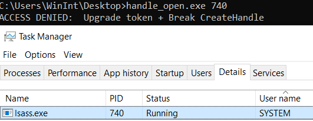
```
0: kd> !process 0 0 handle_open.exe
PROCESS ffffbf05cbc0a540
    SessionId: 1  Cid: 16d4    Peb: 6999d6c000  ParentCid: 228c
    DirBase: 1dd834002  ObjectTable: ffff948b96e97b40  HandleCount:  39.
    Image: handle_open.exe
```
```
0: kd> !process 0 0 system
PROCESS ffffbf05c6660300
    SessionId: none  Cid: 0004    Peb: 00000000  ParentCid: 0000
    DirBase: 001ad002  ObjectTable: ffff948b8ec09d00  HandleCount: 3013.
    Image: System
```
```
0: kd> ?? &((_eprocess *)0xffffbf05c6660300)->Token
struct _EX_FAST_REF * 0xffffbf05`c6660658
   +0x000 Object           : 0xffff948b`8ec0304e Void
   +0x000 RefCnt           : 0y1110
   +0x000 Value            : 0xffff948b`8ec0304e
```
```
0: kd> ?? &((_eprocess *)0xffffbf05cbc0a540)->Token
struct _EX_FAST_REF * 0xffffbf05`cbc0a898
   +0x000 Object           : 0xffff948b`96b8d064 Void
   +0x000 RefCnt           : 0y0100
   +0x000 Value            : 0xffff948b`96b8d064
```

```c
// Set the 8 bytes at the address of the token 
//  field of handle_open.exe's eprocess equal to
//  the contents of the Token field of system's
//  eprocess
0: kd> eq 0xffffbf05`cbc0a898 0xffff948b`8ec0304e
```

After doing this and continuing the vm, we break out of the loop indicating that we've successfully opened a handle to lsass.exe with `PROCESS_ALL_ACCESS` rights. To confirm this we will check the GrantedAccessBits in the handle table of handle_open.exe:

First take the ObjectTable pointer of handle_open.exe's eprocess and cast it to a _handle_table 

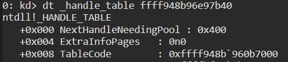

Now dump the TableCode memory to see all the handle_table_entrys we have:
```c
0: kd> dq 0xffff948b`960b7000 l60
ffff948b`960b7000  00000000`00000000 00000000`00000000
ffff948b`960b7010  bf05cf2b`0dd0ffff 00000000`0012019f
... snip ...
ffff948b`960b7270  948b9670`5e40ffff 00000000`00020019
ffff948b`960b7280  bf05cc77`70900001 00000000`001fffff
ffff948b`960b7290  00000000`00000000 ffff948b`960b72a0
ffff948b`960b72a0  00000000`00000000 ffff948b`960b72b0
ffff948b`960b72b0  00000000`00000000 ffff948b`960b72c0
```
We can see the last added entry at `ffff948b960b7280` which, if casted to a _HANDLE_TABLE_ENTRY, we can see has the access rights(`0x1FFFFF: PROCESS_ALL_ACCESS`) we requested:
```c
0: kd> dt _handle_table_entry ffff948b`960b7280
ntdll!_HANDLE_TABLE_ENTRY
    ... snip ...
   +0x000 ObjectPointerBits : 0y10111111000001011100110001110111011100001001 (0xbf05cc77709)
   +0x008 GrantedAccessBits : 0y0000111111111111111111111 (0x1fffff)
    ... snip ...
```

Done! We have full access from our created process to the privileged process. Or do we...

### Odd one out
... This works, on my version of W10, for every process but 1. The process that doesn't play nice is `MsMpEng.exe`. If we take the same steps as before as well as removing the protection in it's eprocess we will see that, while OpenProcess succeeds, we don't get the complete access we were implicitly promised when OpenProcess succeeded. In fact we can use ReadProcessMemory on it but when we use WriteProcessMemory we get an AccessDenied error. How could it be that our handle returned from a successful call to OpenProcess including PROCESS_VM_WRITE rights, doesn't allow us to use WriteProcessMemory? Let's see what happened to our handle this time:
```
0: kd> dt _handle_table_entry ffff948b`960b7210
ntdll!_HANDLE_TABLE_ENTRY
    ... snip ...
   +0x000 ObjectPointerBits : 0y10111111000001011100110101011110011100101101 (0xbf05cd5e72d)
   +0x008 GrantedAccessBits : 0y0000111111111111111010100 (0x1fffd4)
    ... snip ...
```
Our handle isn't equal to `PROCESS_ALL_RIGHTS(0x1FFFFF)` despite the OpenProcess call succeeding, this might explain why we can't use WriteProcessMemory here. 

If we bitwise OR `PROCESS_ALL` with these access rights we will see what was stripped from our 0x1FFFFF to reach the 0x1FFFD4:
```c
PROCESS_CREATE_THREAD (0x0002)
PROCESS_TERMINATE (0x0001)
PROCESS_VM_WRITE (0x0020)
PROCESS_VM_OPERATION (0x0008)
```

But how could this happen with OpenProcess not giving an error? Let's find out.

# ObpCreateHandle
For this one we're gonna have to start at the source. The function responsible for creating handles is `ObpCreateHandle`. This function is incredibly complex, so I'll only go into the areas relevant for this research. If you want to read more about handle creation and other things relevant to handles I highly recommend [this blog post by Sinaei](https://rayanfam.com/topics/reversing-windows-internals-part1/).

### General overview
At the start of the function it decides between 2 major paths:
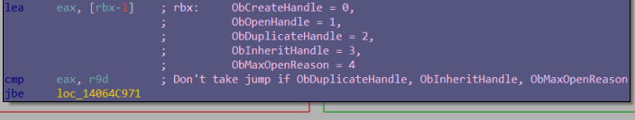

After picking the `ObCreateHandle/ObOpenHandle` path, we encounter the first interesting piece of code in deciding what will happen to our `OpenProcess` call, [SeAccessCheck](https://docs.microsoft.com/en-us/windows-hardware/drivers/ddi/wdm/nf-wdm-seaccesscheck):

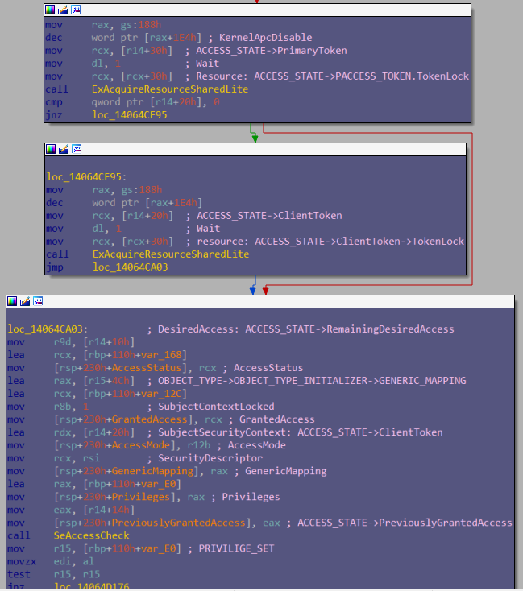

This does a lot of privilege checks using our handle_open.exe's stolen system token. Because it's a lot to reverse, we can instead just follow along in the debugger by breaking on SeAccessCheck:

```c
//RemainingDesiredAccess before the call
kd> dd r14+0x10 l1
fffff90e`e9def860  001fffff
```
```c
//GrantedAccess after the call
kd> dd ebp-1c l1
fffff90e`e9def3a4  001fffff
```
```c
//Return value of SeAccessCheck after the call
kd> r al
al=1
```

From msdn:
>If access is allowed, SeAccessCheck returns TRUE.

Now we know that our system token is privileged enough to request the `PROCESS_ALL_ACCESS` access rights.

After some more minor tests and preperations we encounter the function `ObpCallPreOperationCallbacks` and then we write our data to the HANDLE_TABLE_ENTRY in the handle_open.exe process:


At this point the GrantedAccessBits are already 0x1FFFD4 instead of 0x1FFFFF, so something before this code and after the `SeAccessCheck` is responsible for changing our access rights despite having enough privileges.

# Callbacks
The only other area that really impacts the GrantedAccessBits variable written to the handle_table_entry is the part after `ObpCallPreOperationCallbacks`, which takes a returned argument from that call and edits our GrantedAccessBits with it:
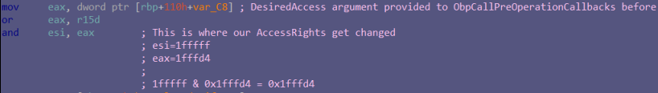

So it seems that `ObpCallPreOperationCallbacks` is responsible for editing our DesiredAccess before they get to the handle entry.
Callbacks can be registered using [ObRegisterCallback](https://docs.microsoft.com/en-us/windows-hardware/drivers/ddi/wdm/nf-wdm-obregistercallbacks) and they trigger under predefined circumstances. In this case Windows Defender registered a callback named `WdFilter!ProcessObjectPreOperationCallback`for opening handles to processes or desktop objects:

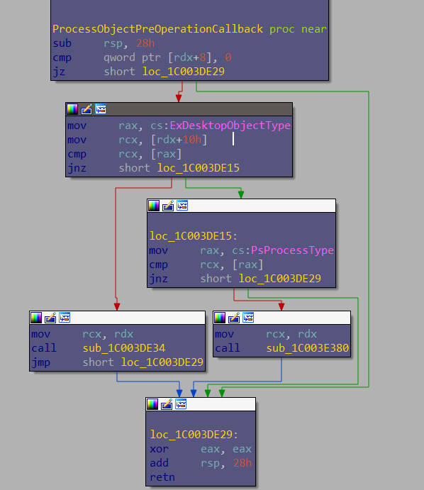


### ProcessPreOperationCallback
>Before I get into the WdFilter callback I want to give credit to n4r1b. I used some of his [reversed structure definitions](https://github.com/n4r1b/WdFilter-Research/) to supplement the disassembly ahead, together with some old WdFilter I had symbols for. (I did discover some new flags and functionality in the callback which I roughly named as I saw them) Check out his WdFilter reverse engineering series [over here](https://n4r1b.netlify.app/posts/2020/01/dissecting-the-windows-defender-driver-wdfilter-part-1/).


After we check that our [OB_PRE_OPERATION_INFORMATION->ObjectType](https://docs.microsoft.com/en-us/windows-hardware/drivers/ddi/wdm/ns-wdm-_ob_pre_operation_information) is PsProcessType we jump to the meat of our callback.

First we check a global flag set inside of a global WdFilter structure named MpData. This bitflag is a flag that seems to turn off, and on, the entire PreOperationCallback functionality.

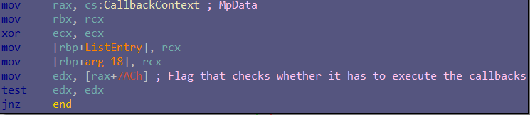

We then check if the handle that's being created isn't a Kernel handle ([OB_PRE_OPERATION_INFORMATION->KernelHandle](https://docs.microsoft.com/en-us/windows-hardware/drivers/ddi/wdm/ns-wdm-_ob_pre_operation_information)) and whether the calling process is MsMpEng.exe(The user-land component of defender)

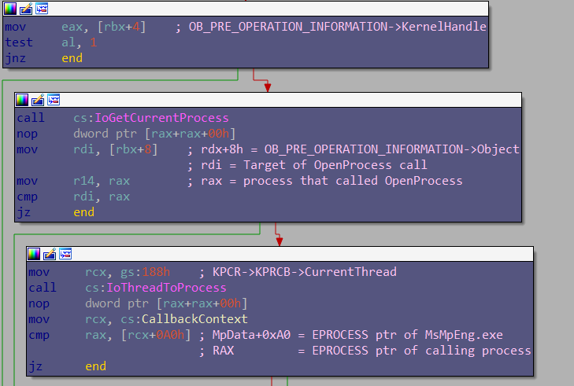

And at last we have a seemingly useless check:

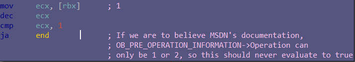

That's it for the checks that would allow WdFilter to ignore this function on handle-creation.

If there is no reason to skip the callback the driver will start by initialising 2 structs, one for the calling process and one for the target process. 

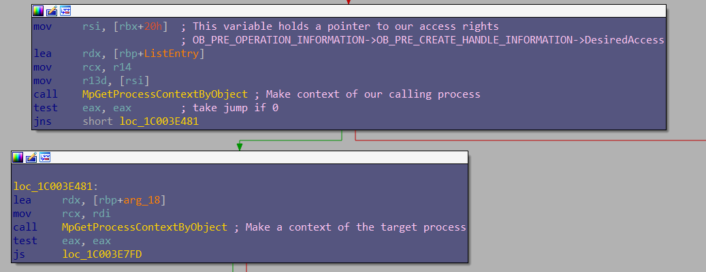

Somewhere inside of there it also loads our [OB_PRE_CREATE_HANDLE_INFORMATION ->DesiredAccess](https://docs.microsoft.com/en-us/windows-hardware/drivers/ddi/wdm/ns-wdm-_ob_pre_create_handle_information), the AccessMask with which we called OpenProcess ([0x1ffff] PROCESS_ALL_ACCESS)

After that we make sure that our Operation == OB_OPERATION_HANDLE_CREATE
and save both processes' pids for (internal) event logging use.

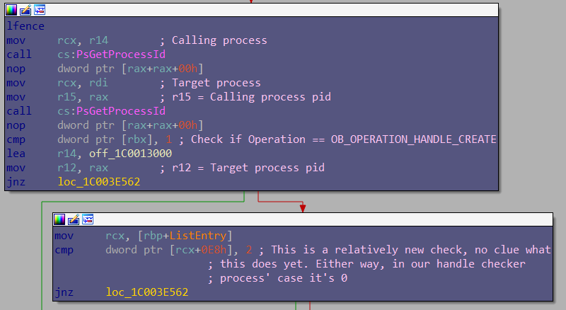

Because of this relatively new check not triggering in our case, we skip a bit of new functionality that looks like this (might be interesting to dive into at a later date):

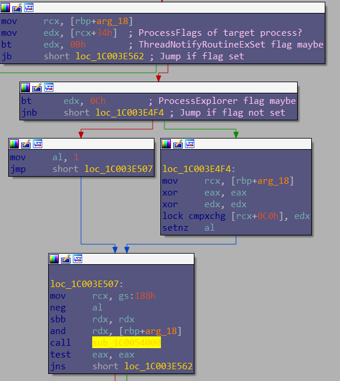

Then after checking some global flags set inside the MpData structure:

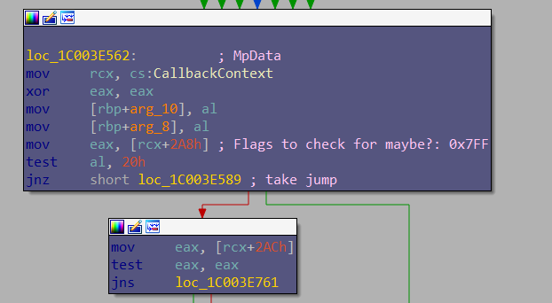

We get to a point where it checks 2 different sets of access rights:

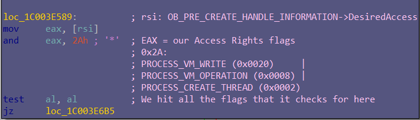

and

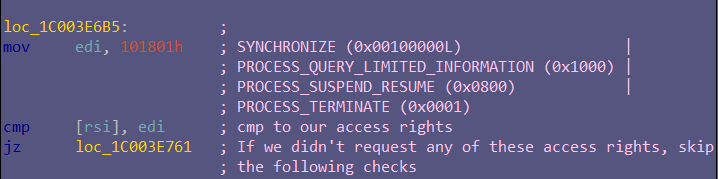


### Process Injection path
Let's first follow the path that's responsible for handling handles with potential process injection access rights.

The main check deciding whether we should even call the functions responsible for checking if injection is allowed is this:

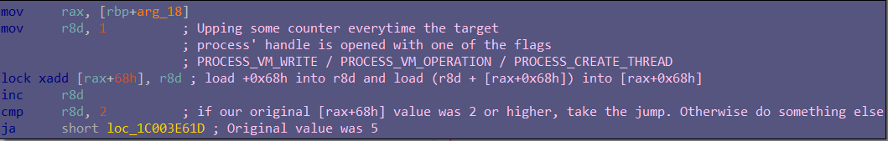

I'm not sure if I grasp this check, but if I understand correctly then the entire "code injection allowed" section is skipped IF the process hasn't had its handle opened with those flags more than twice. My best guess would be that this has to do with crss/lsass or other essential services already being expected to have opened a handle to the target process before it's possible for a normal process to create a handle to it. If we were able to trigger this check and avoid the injection allowed check, we would be able to bypass the first edit of our DesiredAccess entirely:

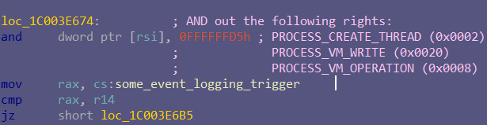

But we would still have to deal with more checks later on (I'll get to those later).

In case the target process has 2 or more handles with these access rights open already we will be taken into a couple of functions that check more flags:

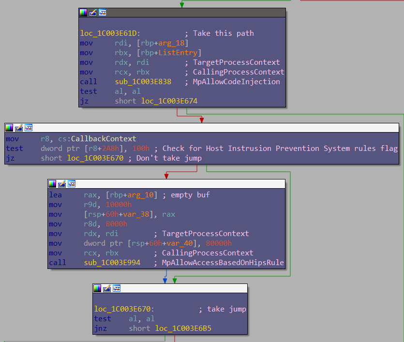

The first function, which according to the symbols of my old WdFilter is called `MpAllowCodeInjection`, will do exactly that. Check if we are allowed to inject code and keep our AccessRights.

#### MpAllowCodeInjection

We are first faced with some checks that would let us off the hook immediately:
* Is our calling process exempt because it's on the exclusion list?
* Is our calling process exempt because it's part of the friendly processes list?
* Do we have a service sid? Spawned by services manager? (not entirely sure on this)
* Are we Svchost (pretty sure)

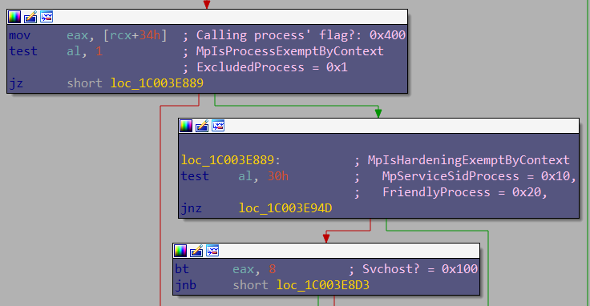

In our case we are merely a normal process with a system token so no luck here, let's see the next checks:

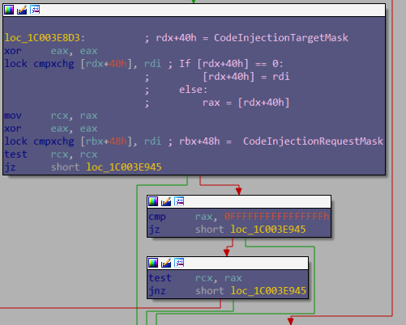

For the main portion of our code injection check the `CodeInjectionTargetMask` member of the target process' context and the `CodeInjectionRequestMask` member of our calling process' context are used.

The only way for this function to return FALSE and thus immediately disallow our process injection is if the following 3 conditions are met:
* CodeInjectionTargetMask of our target process != 0
* CodeInjectionRequestMask of our calling process != 0xFFFFFFFFFFFFFFFF
* CodeInjectionRequestMask & CodeInjectionTargetMask == False

In our case both Masks are 0 and so we pass this test.

#### MpAllowAccessBasedOnHipsRule
The hips check is a bit simpler, checking only 3 flags of which 2 are interesting to us:
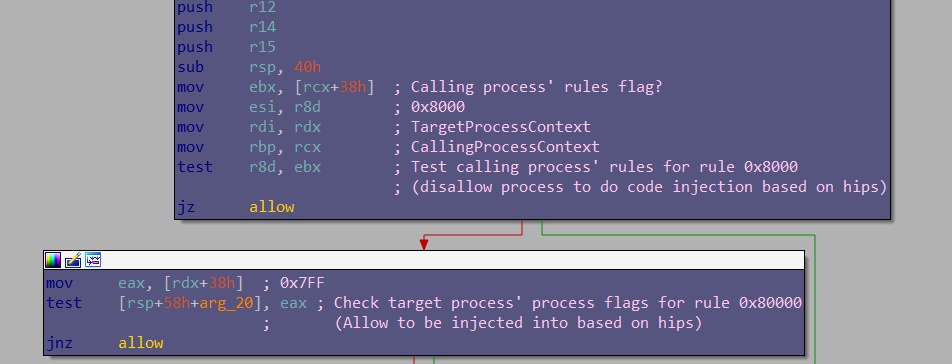

We can infer from this that the ProcessContext+38h field contains some sort of a bitflag rules field which has at least these 2 rules:
* [0x8000]  Disallow code injection by process if set
* [0x80000] Allow code injection into process if set

In our case the calling process has a flag of 0 and our target has a flag of 0x7ff meaning that we aren't disallowed to inject code. The flag to allow code injection into the target process isn't set in this case,  but that doesn't matter because we skip that check by passing the first.

#### failed  route
If we fail to pass either of those check we immediately get hit by a DesiredAccess downgrade of the following access rights as shown before:


### Second set of access rights
The second set of access rights that are checked are a little less intrusive, but might still be too invasive for normal processes to use on protected processes or other privileged processes.

These next set of checks also depend, as before with part of the code-injection checks, on hips functionality being enabled using a flag in MpData:
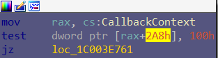

If enabled it checks if we aren't a registered anti-malware process, or higher, by checking the _EPROCESS->Protection flag of our process. (for a more detailed explanation on Protected Processes, [this 3-part blog series](https://www.crowdstrike.com/blog/evolution-protected-processes-part-1-pass-hash-mitigations-windows-81/) by Alex Ionescu is a good place to start)
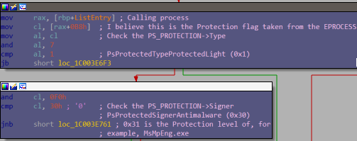


If we aren't a sufficiently privileged protected process it will proceed to do another HIPS rules check using the same function as before, but with 3 new flags. Again, only 2 are really relevant for this research
:
* [0x800000]  We would assume that this flag, if set, would mean something like "disallow synchronize / suspend / terminate / query-limited rights", but this isn't the case as I'll show you in a bit.
* [0x2000000] We would assume for this flag too that, if set, we would be allowed to use those AccessRights in our handle. (not the case)

If the first flag isnt set, or is set in combination with the second flag, then we will skip some altering of our handle. If we, however, do not pass the HIPS checks, our edit rights will be edited, but not in a way that makes much sense to me:
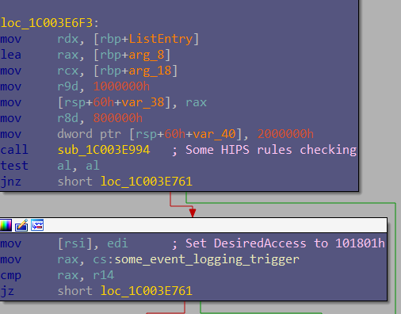


So what I would expect when failing the check is:
```c
//Selectively remove the checked access rights
PROCESS_ALL_ACCESS & 
(SYNCHRONIZE (0x00100000L)                 | 
PROCESS_QUERY_LIMITED_INFORMATION (0x1000) | 
PROCESS_SUSPEND_RESUME (0x0800)            | 
PROCESS_TERMINATE (0x0001))
```
But what happens instead is:
```c
// Grant exactly the access rights we checked for
DesiredAccess = (SYNCHRONIZE (0x00100000L)                 | 
                PROCESS_QUERY_LIMITED_INFORMATION (0x1000) | 
                PROCESS_SUSPEND_RESUME (0x0800)            | 
                PROCESS_TERMINATE (0x0001))
```

So if we have any of those 4 access rights defined in our DesiredAccess then, no matter what, after this check we will still have them. At worst we will lose some of the requested access rights that aren't one of those 4. If anyone knows the reason for this, let me know!

### Last check
After processing our DesiredAccess it seems to send a notification about the fact that a process was opened using `MpObSendOpenProcessBMNotification`
and then gets to the last check. Here we first check if the target process'(MsMpEng.exe) sid isnt that of the service manager


If it is we do 2 more checks (which used to be done inside a function called `MpIsHardeningExemptByContext`):
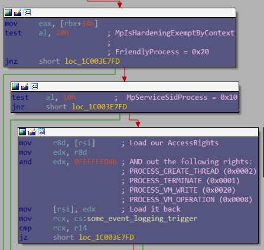

The first is whether we are a whitelisted "friendly" process and the second is whether we have a service SID ourselves or not. If we aren't either of those then our access rights get stripped of terminate and code-injection rights, irregardless of any previous checks:

* PROCESS_CREATE_THREAD (0x0002)
* PROCESS_TERMINATE (0x0001)
* PROCESS_VM_WRITE (0x0020)
* PROCESS_VM_OPERATION (0x0008)

This is also what has happened, in the end, to our own handle which was requested with a system token.

# Conclusion
After analyzing the full callback we can take away the following points:

If any of these conditions apply then none of the other checks matter:
* Is the flag, that determines if the callback is used, set inside of the global struct? If it is then our handle's GrantedAccessBits stay as is.
* Are we MsMpEng.exe? Our handle stays the same
* Are we opening a handle from kernel-mode? Our handle stays the same
* Are we doing an Operation that isn't one of the 2 documented ones on msdn? Our handle stays intact

To keep ProcessInjection rights we definitely need to do the following:
* Not targeting a process with a service SID
    * But if we do, we better make sure we're either a whitelisted "friendly process"
    * Or have the service SID ourselves

As well as be one of these:
* Get our process on the excluded list (ProcessContext->Flags1 & 0x1)
* Be a whitelisted "friendly process"
* Have a service manager sid
* Be Svchost

OR (this can be done by simply being system as we've seen)
* Pass the CodeInjectionMask tests (how to do this might be part of future research)
* And pass the HIPS flag checks (Also not sure how these flags are calculated yet)

And don't forget:
* If you request any of the access rights in the other check and you fail that check, all access rights except for those 4 will be stripped.

So as system we can keep doing our process injection as long as we aren't targeting something(spawned by?) with the service manager SID. If we do want to target something with such a SID we will need to become real friendly with microsoft or just use the Service SID ourselves as well.

